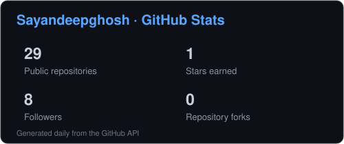
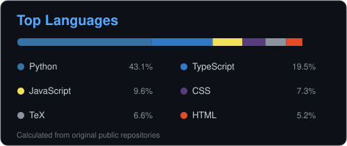
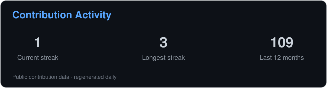

# Hi, I'm Sayandeep Ghosh 👋

### AI • Quantitative Systems • Mathematical Research • Algorithms

---

## 👨‍💻 About Me

- 🔬 **Currently focused on** reproducible computational and analytic research around the **Riemann Hypothesis**
- 🤖 **Building AI applications** across web and Android
- 📈 **Exploring quantitative systems**, market analysis, forecasting, and automated trading
- 🧠 **Long-time interest in algorithms**, data structures, and competitive programming
- 🛠️ **Working with** Python, FastAPI, React, Kotlin, Jetpack Compose, JavaScript, Docker, and algorithmic problem solving
- 🌐 **Portfolio:** [sayandeepghosh.github.io](https://sayandeepghosh.github.io/)

---

## 🚀 Featured Work

<table>
<tr>
<td width="50%" valign="top">

### 🔬 [Riemann Hypothesis Research](https://github.com/Sayandeepghosh/riemann-hypothesis)

An open, reproducible research record covering computational experiments, analytic derivations, tests, negative results, and rigorous self-audit around the Riemann Hypothesis.

</td>
<td width="50%" valign="top">

### 📈 [AI Stock Predictor](https://github.com/Sayandeepghosh/ai_stock_predictor)

A React + FastAPI market-analysis application with stock data, technical indicators, interactive charts, forecasting experiments, and deployment tooling.

</td>
</tr>

<tr>
<td width="50%" valign="top">

### 🤖 [AI Doubt Solver](https://github.com/Sayandeepghosh/AI-DoubtSolver-App)

An Android AI assistant using Kotlin, Jetpack Compose, OCR, speech-to-text, and a Python/FastAPI backend for question answering and step-by-step explanations.

</td>
<td width="50%" valign="top">

### ⚡ [Quantum Trading Bot](https://github.com/Sayandeepghosh/quantum-trading-bot)

An educational automated-trading system exploring mean reversion, momentum, machine-learning signals, risk management, portfolio analytics, FastAPI, and React.

</td>
</tr>
</table>

---

## 🧰 Tech I Work With

---

## 📊 GitHub Stats

  

---

## 🐍 Contribution Trail

<picture>
  <source
    media="(prefers-color-scheme: dark)"
    srcset="./assets/github-snake-dark.svg"
  />
  <source
    media="(prefers-color-scheme: light)"
    srcset="./assets/github-snake.svg"
  />
  
</picture>

## 🧭 What You'll Find Here

My repositories span several phases of learning and experimentation — from competitive programming and data structures to AI applications, finance tooling, and reproducible mathematical research.

I prefer keeping experiments visible, including failed approaches and limitations, because useful engineering and research are as much about discovering what *doesn't* work as what does.

---

### 🚀 Build. Test. Learn. Document. Repeat.

